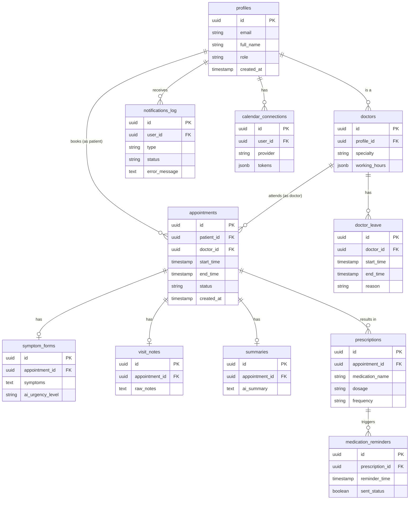

# Database Documentation

## ER Diagram

## Tables

### `profiles`
- **Columns**: `id` (UUID, PK), `email` (Text, Unique), `full_name` (Text), `role` (Text), `created_at` (Timestamp).
- **Constraints**: `role` IN ('patient', 'doctor', 'admin').

### `doctors`
- **Columns**: `id` (UUID, PK), `profile_id` (UUID, FK -> profiles.id), `specialty` (Text), `working_hours` (JSONB).

### `doctor_leave`
- **Columns**: `id` (UUID, PK), `doctor_id` (UUID, FK -> doctors.id), `start_time` (Timestamp), `end_time` (Timestamp), `reason` (Text).

### `appointments`
- **Columns**: `id` (UUID, PK), `patient_id` (UUID, FK -> profiles.id), `doctor_id` (UUID, FK -> doctors.id), `start_time` (Timestamp), `end_time` (Timestamp), `status` (Text), `created_at` (Timestamp).
- **Constraints**: `status` IN ('held', 'confirmed', 'completed', 'cancelled', 'rescheduled').

### `symptom_forms`
- **Columns**: `id` (UUID, PK), `appointment_id` (UUID, FK -> appointments.id), `symptoms` (Text), `ai_urgency_level` (Text).

### `visit_notes`
- **Columns**: `id` (UUID, PK), `appointment_id` (UUID, FK -> appointments.id), `raw_notes` (Text).

### `summaries`
- **Columns**: `id` (UUID, PK), `appointment_id` (UUID, FK -> appointments.id), `ai_summary` (Text).

### `prescriptions`
- **Columns**: `id` (UUID, PK), `appointment_id` (UUID, FK -> appointments.id), `medication_name` (Text), `dosage` (Text), `frequency` (Text).

### `medication_reminders`
- **Columns**: `id` (UUID, PK), `prescription_id` (UUID, FK -> prescriptions.id), `reminder_time` (Timestamp), `sent_status` (Boolean).

### `notifications_log`
- **Columns**: `id` (UUID, PK), `user_id` (UUID, FK -> profiles.id), `type` (Text), `status` (Text), `error_message` (Text).

### `calendar_connections`
- **Columns**: `id` (UUID, PK), `user_id` (UUID, FK -> profiles.id), `provider` (Text), `tokens` (JSONB).

## Important Constraints
- **Double-Booking Prevention**: A partial unique index on `appointments (doctor_id, start_time)` where `status` is IN ('held', 'confirmed', 'completed').
- **Status Check Constraints**: Ensure only valid statuses are applied to `appointments` and `notifications_log`.
- **Unique Constraints**: Unique email on `profiles`, unique `appointment_id` on `symptom_forms`, `visit_notes`, and `summaries`.

## Indexes
- Index on `appointments(doctor_id, start_time)` for quick availability checks.
- Index on `appointments(patient_id)` for fetching patient history.
- Index on `notifications_log(status)` for processing queues.

## RLS Policies
- **profiles**: Users can SELECT/UPDATE their own rows. Admins have ALL privileges.
- **appointments**: Patients can SELECT/INSERT/UPDATE their own. Doctors can SELECT/UPDATE assigned. Admins ALL.
- **Other clinical data**: Read access restricted to the patient and the assigned doctor. Admin ALL.
- **calendar_connections**: Only owner can SELECT/INSERT/UPDATE/DELETE.

## Database Functions
- `get_available_slots(doctor_id, date)`: Returns unbooked slots.
- `hold_slot(doctor_id, start_time)`: Transactionally attempts to insert a 'held' appointment.
- `has_role(role_name)`: Checks if `auth.uid()` has the specified role in the `profiles` table.
